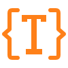

# TypeSafe

TypeSafe is a modern, blazing fast LaTeX editor built with **Rust** and **egui**. It is designed for reliability, speed, and a crash-free experience.



## Features

- **Blazing Fast Compilation**: Powered by the [Tectonic](https://tectonic-typesetting.github.io/) engine.
- **Live Preview**: Embedded PDF viewer using `pdfium-render` with fast refresh.
- **SyncTeX Support**:
  - **Forward Search**: Ctrl+J (or Right Click -> Go to PDF) to jump to the PDF location.
  - **Inverse Search**: Double-click the PDF to jump to the source code.
- **Offline Spell-Checking**: Built-in dictionary with suggestions.
- **Thesaurus**: Online synonym lookup via Datamuse API.
- **Auto-Complete**: Intelligent suggestions for LaTeX commands and environments.
- **Memory Safe**: Written in Rust to prevent common crashes and segmentation faults.

## Website

The official website is hosted on Cloudflare Pages and includes the latest download link.
Source code for the website is located in `web/`.

## Installation

### Download

You can download the latest alpha release (`typesafe-alpha.zip`) from our website or build it yourself.

### Build from Source

**Prerequisites:**
- Rust (Cargo) installed.
- Windows (currently targeted platform, though Linux/macOS support is possible).

**Steps:**

1.  Clone the repository.
2.  Build the release binary:
    ```bash
    cargo build --release
    ```
    This will compile the application. The executable will be located in `target/release/typesafe.exe`.

    *Note: The build process automatically downloads necessary dependencies (`tectonic` and `pdfium`) into the `deps/` directory.*

3.  **Run**:
    You can run the application directly via Cargo:
    ```bash
    cargo run --release
    ```

    Or run the executable from `target/release/`. Ensure that `tectonic.exe` and `pdfium.dll` are accessible (either in the same directory, in a `deps/` subdirectory, or on your system PATH).

## Project Structure

- `src/`: Rust source code.
- `web/`: React + Vite website source.
- `deps/`: External binaries (Tectonic, PDFium) downloaded during build.
- `build.rs`: Cargo build script for downloading dependencies.

## License

MIT License.